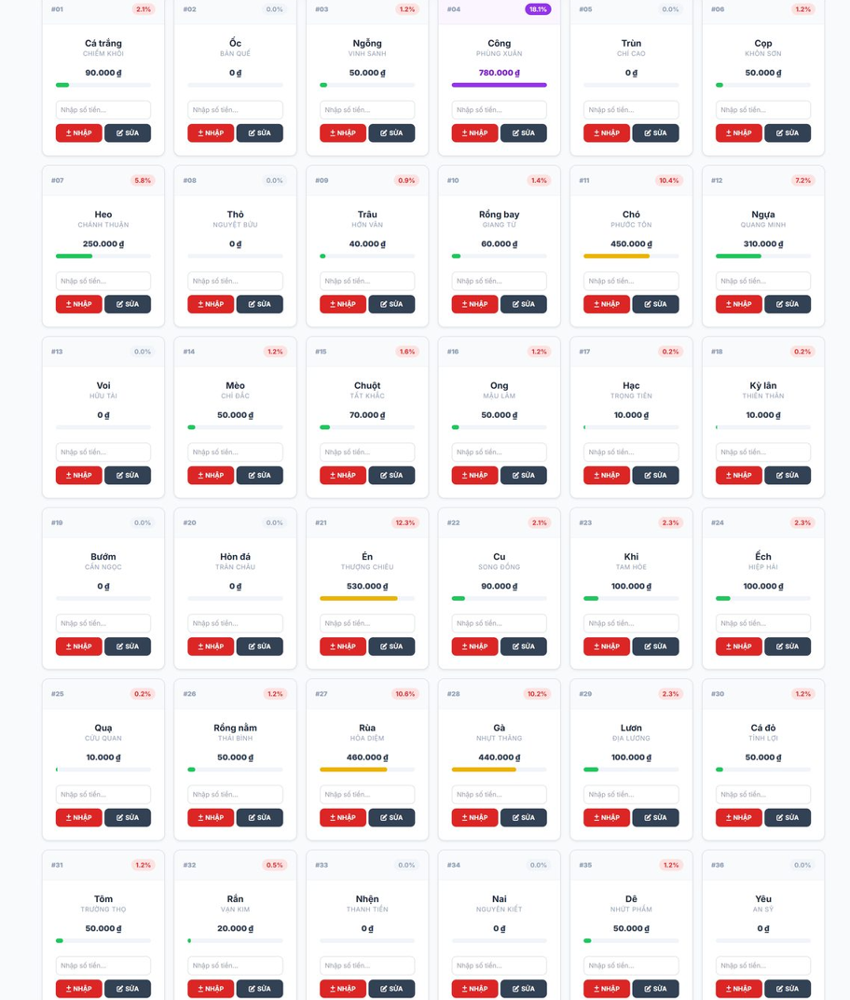

# Lucky Draw - 36 Animals Game

## 1. Overview

A web-based lucky draw game featuring 36 animals, designed as a betting/lottery management tool. The operator inputs bets placed by buyers on each animal square and tracks winnings.

## 2. UI Reference

The main screen displays a **6x6 grid** (36 cells). Each cell contains:

- **Row 1**: Other Name in subtle gray (e.g., CHIẾM KHÔI) + Animal Name bold (e.g., CÁ TRẮNG)
- **Row 2**: List of individual bet amounts, space-separated (e.g., `50 30 20`)
- **Row 3**: Total bet amount as plain number (e.g., `100`)
- **Row 4**: Tags in blue badge (e.g., `1S, 2C`) — optional
- **Row 5**: Notes in yellow badge — optional, last row of the cell

The toolbar ("3 cột / 6 cột", "Ván mới", game selector) is fixed at the **bottom** of the page.

## 3. Tech Stack

| Layer        | Technology                         |
| ------------ | ---------------------------------- |
| Frontend     | React JS                           |
| Data Storage | IndexedDB (local, no backend needed) |

## 4. Target Devices / Browsers

- Samsung Galaxy A23 and above
- iPhone 13 and above
- Mobile-first responsive design

## 5. The 36 Animals

Animal names and default configuration are stored in `src/db.js` (`DEFAULT_ANIMALS`) and deployed via GitHub Pages. Changes to the source file are the only way to update animal names or default configuration.

| #  | Name     | Other Name   |
| -- | -------- | ------------ |
| 1  | CÁ TRẮNG | CHIẾM KHÔI   |
| 2  | ỐC       | BẢN QUẾ      |
| 3  | NGỖNG    | VINH SANH    |
| 4  | CÔNG     | PHÙNG XUÂN   |
| 5  | TRÙN     | CHÍ CAO      |
| 6  | CỌP      | KHÔN SƠN     |
| 7  | HEO      | CHÁNH THUẬN  |
| 8  | THỎ      | NGUYỆT BỬU   |
| 9  | TRÂU     | HỚN VÂN      |
| 10 | RỒNG BAY | GIANG TỪ     |
| 11 | CHÓ      | PHƯỚC TÔN    |
| 12 | NGỰA     | QUANG MINH   |
| 13 | VOI      | HỮU TÀI      |
| 14 | MÈO      | CHỈ ĐẮC      |
| 15 | CHUỘT    | TẤT KHẮC     |
| 16 | ONG      | MẬU LÂM      |
| 17 | HẠC      | TRỌNG TIÊN   |
| 18 | KỲ LÂN   | THIÊN THÂN   |
| 19 | BƯỚM     | CẤN NGỌC     |
| 20 | HÒN ĐÁ   | TRÂN CHÂU    |
| 21 | ÉN       | THƯỢNG CHIÊU |
| 22 | CU       | SONG ĐỒNG    |
| 23 | KHỈ      | TAM HÒE      |
| 24 | ẾCH      | HIỆP HẢI     |
| 25 | QUẠ      | CỬU QUAN     |
| 26 | RỒNG NẰM | THÁI BÌNH    |
| 27 | RÙA      | HỎA DIỆM    |
| 28 | GÀ       | NHỰT THĂNG   |
| 29 | LƯƠN     | ĐỊA LƯƠNG    |
| 30 | CÁ ĐỎ   | TỈNH LỢI     |
| 31 | TÔM      | TRƯỜNG THỌ   |
| 32 | RẮN      | VẠN KIM      |
| 33 | NHỆN     | THANH TIỀN   |
| 34 | NAI      | NGUYÊN KIẾT  |
| 35 | DÊ       | NHỨT PHẨM    |
| 36 | YÊU      | AN SỸ        |

## 6. Core Features

### 6.1 Game Board (Main Screen)

- Switchable layout: **6 columns** (compact) or **3 columns** (larger, easier to read)
  - Toggle via the toolbar button at bottom
  - **3-column mode**: Every 2 rows (6 cells) have alternating backgrounds for better readability
    - Rows 1-2, 5-6, 9-10 share one style (white background)
    - Rows 3-4, 7-8, 11-12 share another style (light gray background)
    - Cells with bets get a light blue background highlight
    - Larger fonts for better readability
  - **6-column mode**: All cells have the same white background for consistency
    - No alternating background colors
    - Cells with bets show visual distinction through border color and shadow only (not background color)
- Each square shows:
  - **Other Name** in subtle gray (less dominant)
  - **Animal Name** bold below it
  - **Bet amounts** as a space-separated list of individual bets (e.g., `50 30 20`)
  - **Total** as a plain number (no "K" suffix)
  - **Tags** as individual rounded pills with blue border below total (e.g., `1S` `2C`) — optional, comma-separated input, multiple per cell
  - **Notes** in yellow badge as the last row — optional per cell
- Tapping/clicking a square opens an input form for that animal
- Below the board a **summary bar** shows live statistics (see section 6.3)

### 6.2 Bet Input Per Square

- **Multiple bets per square** — different buyers can bet on the same animal
- Each bet entry is a **money amount** only (no per-bet notes)
- Each bet entry has a **Delete** button to remove it
- **Tags per cell** — comma-separated labels (e.g., `1S, 1C, 2S, 2C`), each displayed as a rounded blue pill badge
- **One note per cell** — a free-text note attached to the animal square itself (e.g., "winner yesterday morning"), displayed in yellow as the last row

### 6.3 Board Summary (Below the Grid)

Displayed immediately below the animal grid, always visible for the active game:

- **Tổng tịch / Số con**: Total money across all bets + count of animals that have at least one bet (e.g., `Tổng tịch: 1,250 · Số con: 12/36`)
- **Tổng cột**: 6 values — one sum per physical column of the 6×6 grid (column 1 = animals 1,7,13,19,25,31 · column 2 = animals 2,8,14,20,26,32 · etc.). Each column value highlights blue when non-zero.
- **Đánh nhiều**: All animals that have at least one bet, sorted by total descending (highest first). Displayed below Tổng cột. Only shown when at least one animal has bets.

### 6.4 Default Cell Configuration

- Each animal has **default tags** and **default notes** defined directly in the source code (`DEFAULT_ANIMALS` array in `src/db.js`)
- **To update defaults**: edit `defaultTags` / `defaultNotes` for any animal in that array, then deploy to GitHub Pages — no UI or version bump needed
- On every page load, the app automatically syncs the source-code defaults into IndexedDB (`db.on('ready')`), so **all mobile browsers receive the new defaults after the next deploy** without any manual setup
- When creating a new game ("Ván mới"), the current defaults are applied to all cells of the new game
- After a game is created, tags and notes can be edited per-game (via the bet dialog) without affecting:
  - The source-code defaults (used for future new games)
  - Any other existing games (each game stores tags/notes independently)
- There is **no settings UI** for defaults — configure them in `src/db.js` and redeploy

### 6.4 Multi-Game Management

- The app supports **multiple games** (rounds) stored simultaneously
- Each game stores **bet numbers, tags, and notes** independently — tags and notes are initialized from animal defaults when creating a new game
- **Game operations:**
  - **Create**: "Ván mới" button creates a new game (auto-named "Ván N"), applies default tags/notes to all animals, and switches to it
  - **Switch**: Tap the game name button in toolbar to open the game manager, then tap a game to switch
  - **Rename**: Edit a game's name inline in the game manager
  - **Copy (Chép)**: Duplicate all individual bet entries, tags, and notes from an existing game to a new game (appends " (bản sao)" to name)
  - **Copy as Sum (Chép ∑)**: Create a new game where each animal has exactly one bet entry equal to the sum of all its bets in the source game — tags and notes are also copied (appends " (tổng)" to name)
  - **Export (Xuất)**: Download the game's bets and metadata as a `.json` file. This file can be pasted into the `SEEDED_GAMES` array in `src/db.js` and deployed to GitHub Pages, causing all devices to automatically receive the game on the next page load
  - **Delete**: Remove a game and all its data (bets, tags, notes) with confirmation dialog. Cannot delete the last remaining game
- **Game Manager Dialog**: A bottom-sheet modal (same pattern as bet dialog) listing all games sorted newest-first
  - Active game shown with a green dot indicator
  - Each game row has action buttons: "Đổi tên" (Rename), "Chép" (Copy), "Chép ∑" (Copy as Sum), "Xuất" (Export), "Xoá" (Delete)
- **Data model:**
  - `games` table: `id` (auto-increment), `name`, `createdAt`
  - `settings` table: key-value store for app settings (e.g., `activeGameId`)
  - `bets` table: each bet has a `gameId` foreign key linking to the active game
  - `animalGameMeta` table: stores per-game tags and notes (`gameId`, `animalId`, `tags`, `notes`)
  - `settings` table also stores `importedSeedIds` (JSON array) — tracks which seeded games have already been imported on this device
- **Seeded Games (cross-device distribution)**:
  - The `SEEDED_GAMES` array in `src/db.js` can hold exported game objects
  - On every page load, the app checks for any entries not yet imported (by `seedId`) and adds them to IndexedDB
  - Workflow: Export a game → paste the JSON into `SEEDED_GAMES` in source code → deploy to GitHub Pages → all devices receive the game automatically on next load

### 6.5 Animal Configuration (Source Code)

- All 36 animals are defined in the `DEFAULT_ANIMALS` array in `src/db.js`
- Each entry contains: `order`, `name`, `otherName`, `defaultTags`, `defaultNotes`
- To update any value: edit the array and redeploy to GitHub Pages
- On the next page load all devices pick up the new defaults automatically (via `db.on('ready')`)
- Existing game-specific tags/notes are **never overwritten** by a default sync — only the stored defaults change

### 6.6 Toolbar (Bottom)

- Fixed at the **bottom** of the page
- Contains: **"3 cột / 6 cột"** (layout toggle), **"Ván mới"** (New Round), **Game Name ▾** (game selector)
- "3 cột / 6 cột" toggles between 3-column and 6-column layouts
- "Ván mới" creates a new game with source-code defaults applied to all cells, then switches to it
- Game name button shows the active game name and opens the Game Manager dialog

### 6.7 Data Persistence

- All bets and configuration stored in **IndexedDB**
- Data survives page refreshes and browser restarts
- No backend / server required

## 7. Decisions

- No "draw result" feature — this is a bet-tracking tool only
- No maximum bet limit per square
- Multiple bets allowed per square (different buyers)
- Currency displayed as plain numbers (no "K" suffix on the grid)
- Grid is always 36 animals (switchable between 3-column and 6-column layout)
- Vietnamese only — no multi-language support needed
- No payout/multiplier calculation (may add later)
- Multiple games can be stored and switched between
- Each game stores its own bets, tags, and notes independently
- Default tags and notes are defined in source code (`src/db.js`) and auto-synced to all devices on deploy
- Games can be exported as `.json` and seeded back into all devices via source code + GitHub Pages deploy

## 8. Future Enhancements

- Payout / multiplier calculation
- Bet history tracking across rounds (notes-based)

---

*This document is a living spec. Update it as requirements evolve.*
